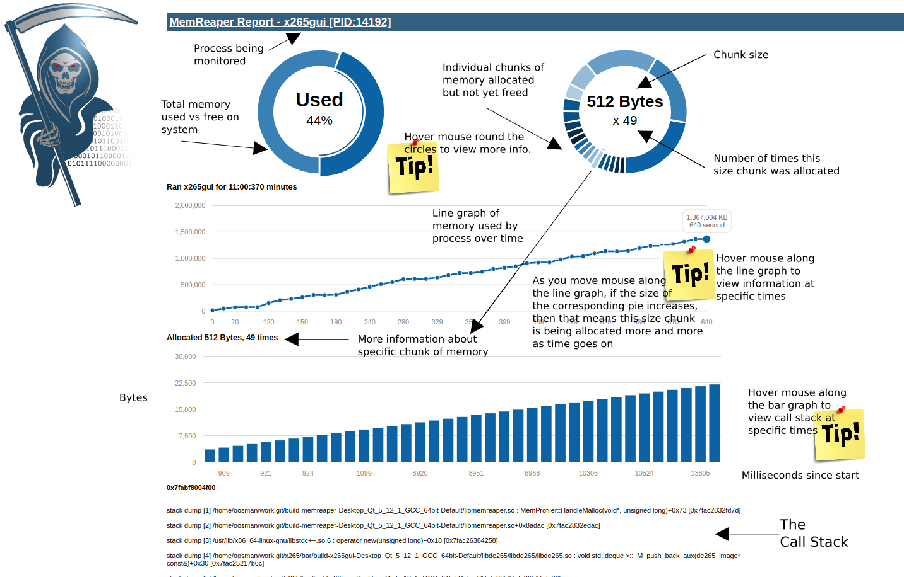

# memreaper
Graphical approach to discovering memory leaks


### How to Guide



### To run:
```
sudo mkdir -p /memreaper
echo -n "name of process to monitor" > /memreaper/appname
LD_PRELOAD=/<path to>/libmemreaper.so /<path to process to monitor>

# Example:
sudo mkdir -p /memreaper
echo -n "x265gui" > /memreaper/appname
LD_PRELOAD=/home/oosman/work.git/build-memreaper-Desktop_Qt_5_12_1_GCC_64bit-Default/libmemreaper.so /home/oosman/work.git/x265/bar/build-x265gui-Desktop_Qt_5_12_1_GCC_64bit-Default/x265gui
```

### Sample output you should see if memreaper starts properly:
```
======================MemReaper======================
 SELF: x265gui
 PID: 14192
 Monitoring App: x265gui
 Only log mallocs >= 100 bytes
 Only log mallocs that occur >= 10 times for each size
 Only show 20 pies
 Only show 40 callstacks
 Dump backtraces for allocated memory every 60 seconds
 Log total memory usage every 10 seconds
--->
```
### Params that can be configured (these are the defaults and you don't need to set them)

```
echo -n "100" > /memreaper/min_alloc_bytes
echo -n "10" > /memreaper/min_num_allocs
echo -n "60" > /memreaper/dump_interval_seconds
echo -n "20" > /memreaper/max_pies
echo -n "40" > /memreaper/max_callstacks
echo -n "10" > /memreaper/memlog_interval_seconds
```


